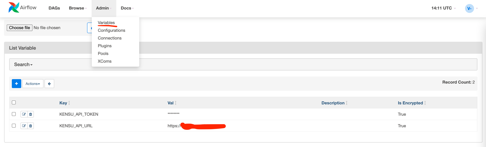

Installation on Google Cloud
------

- create a new Composer environment
- Add the following "PYPI packages" tab of composer "Environment details":
```
Name    Version
----    -------
kensu   [gbq, pandas, airflow-google]

# the ones below should be loaded autoamtically through kensu[airflow-goofle]
# twine   <=3.8.0
# fsspec
# gcsfs
```
-  For sample Airflow app to work set these env vars to point to your GCP cluster or modify the sample airflow app in [./combined_data_ingestion_and_processing.py](./combined_data_ingestion_and_processing.py):
    * GCP_PROJECT_ID
    * GCP_GCS_BUCKET
- manually create an empty bigquery dataset  in your GCP project named `trips_data_all` in [https://console.cloud.google.com/bigquery](https://console.cloud.google.com/bigquery)
- modify your job code to import the supported operators from package with `kensu.` prefix, e.g. (already done in sample project):
```python
# use `kensu.airflow.operators.bash` instead of `airflow.operators.bash` and so on...
from kensu.airflow.operators.bash import BashOperator
from kensu.airflow.operators.python import PythonOperator
from kensu.airflow.providers.google.cloud.operators.bigquery import BigQueryInsertJobOperator
from kensu.airflow.providers.google.cloud.operators.bigquery import BigQueryCreateExternalTableOperator
from kensu.airflow.providers.google.cloud.transfers.gcs_to_gcs import GCSToGCSOperator
```


Kensu Config options / debugging
------

### Setup
Add kensu URL/token to either `conf.ini` in `dags/` dir or Airflow variables as show below:



If you're running airflow locally these could also be set like this:
```
export AIRFLOW_VAR_KENSU_API_URL=BAR
```

### Debug

 Here's example how to enable debugging by sending Kensu entities both in logs and to Kensu app, by placing Kensu's `conf.ini` in airflow `dags` dir (see [conf.ini](../../conf.ini))

```ini
[kensu.reporter]
; Name (class but conventional for now) of the reporter
;name can be KafkaReporter, PrintReporter, LoggingReporter, FileReporter, MultiReporter, ApiReporter
name=MultiReporter

; Conf: MultiReporter
reporters=["LoggingReporter", "ApiReporter"]

; Conf: KafkaReporter
;bootstrap_servers=[]
;topic=kensu-events

; Conf: FileReporter
;file_name=kensu-events.jsonl

; Conf: LoggingReporter
level=WARN

```


Caveats
------

- after copying files to G Cloud Storage it may take a while until Airflow syncs the file (might be old files for ~60s)